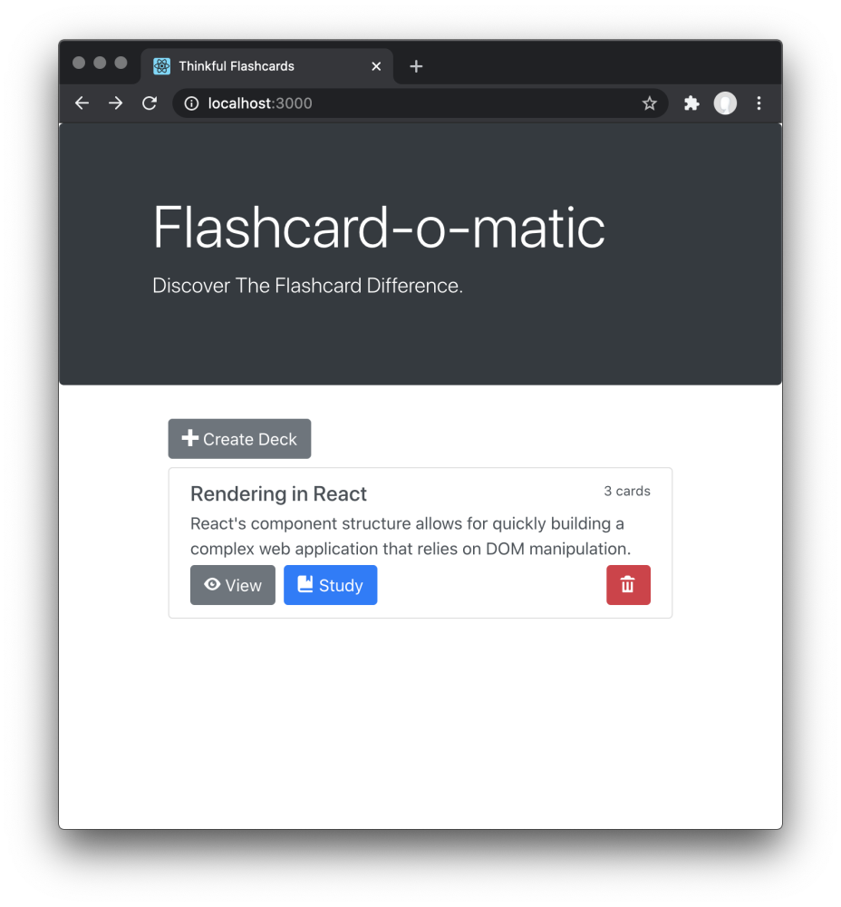

# Project: Flashcard-o-matic

> A local school has decided to put together a flashcard application, Flashcard-o-matic, to help their students study online. This application will allow teachers to create decks of flashcards for the subjects they teach, and students will study the decks.



## Project setup

Follow the instructions below to get this project up and running on your own machine:

- Fork and clone this repository.
- Run `npm install` to install the dependencies needed for this project.

To run the tests, you can run the following command:

```bash
npm test
```

To watch how the code you write affects the application website, you can run the following command, which will start a server and take over your terminal window:

```bash
npm start
```

To stop the server and regain control of your terminal, you can press `Ctrl + C`.